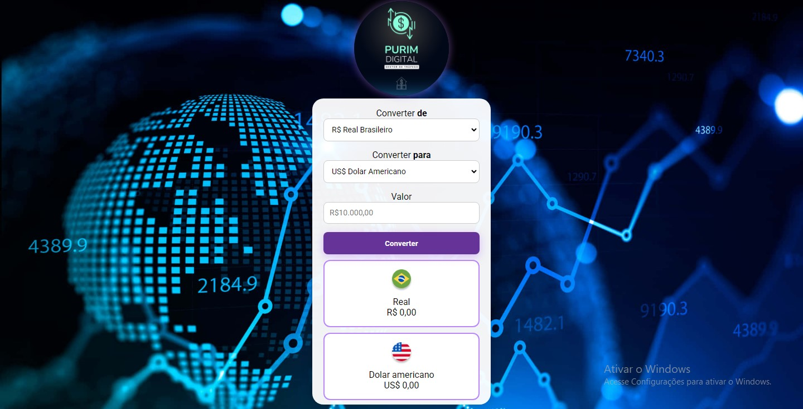

# 💱 Conversor de Moedas - PURIM DIGITAL

Este é um projeto simples e funcional de um **Conversor de Moedas**, feito com **HTML**, **CSS** e **JavaScript** puro. Ele permite converter valores entre moedas como **Real**, **Dólar**, **Euro**, **Libra** e **Bitcoin**, com imagens e nomes dinâmicos.

 <!-- Substitua pelo nome da sua imagem de interface -->
<a href="https://admirable-sawine-ddac0a.netlify.app">🔗Link do site🌎</a>
---

## 🚀 Funcionalidades

- Conversão entre 5 moedas (BRL, USD, EUR, GBP, BTC)
- Interface moderna e responsiva
- Exibição de imagens e nomes das moedas envolvidas
- Alerta de erro para valores inválidos
- Animações suaves e layout intuitivo

---

## 🧠 Como funciona

O código usa taxas de câmbio simuladas e realiza as seguintes etapas:

1. Captura o valor digitado e as moedas escolhidas nos menus.
2. Aplica a taxa de conversão com base em uma matriz fixa.
3. Exibe o valor convertido com formatação correta e o nome/imagem das moedas.
4. Alerta o usuário caso insira um valor inválido.

### Exemplo da lógica principal:

```js
if (moedaOrigem !== moedaDestino) {
    taxa = taxas[moedaOrigem][moedaDestino];
}
const convertido = valor * taxa;
